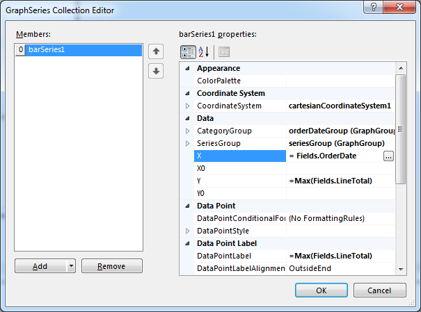
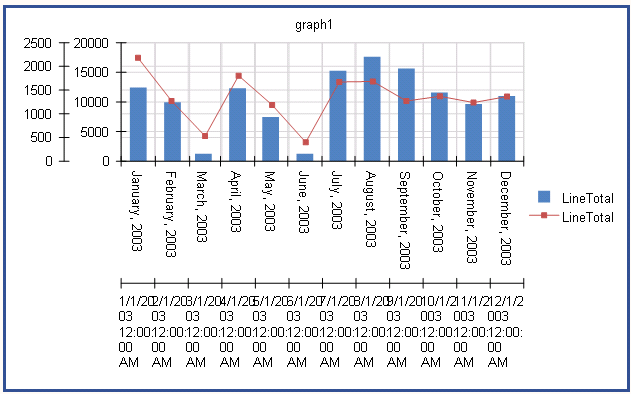
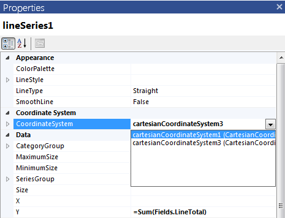

# How to Create Graph with Column and Line Series

In this how-to article we will show you how to create a graph with both column and line series, showing the maximum
        and the average amount of sales on a monthly basis using the __AdventureWorks__ sample database.
      How to create a Graph with Column and Line Series

Start the Graph Wizard:

* If you use [Standalone Telerik Report Designer]()From the __Insert__ menu select __Column__ and then __Clustered Column__.
                  This will bring up the __Graph Wizard__ which will help you create the first series.
                

* If you use the [Visual Studio Report Designer]():Initiate the __Graph Wizard__ from the __Visual Studio toolbox__. Then select __Clustered Column__ chart type and click 
                  __OK__. 
                  This will bring up the __Graph Wizard__ which will help you create the first series.
                

Add new 
              __[SqlDataSource]()__:
            

1. Set the connection string to the demo AdventureWorks database.

1. Set the query to the following one:

	
                  SELECT SOD.LineTotal, SOH.OrderDate
                  FROM
                  Sales.SalesPerson S
                  INNER JOIN Sales.SalesOrderHeader SOH ON SOH.SalesPersonID = S.SalesPersonID
                  INNER JOIN Sales.SalesOrderDetail SOD ON SOH.SalesOrderID = SOD.SalesOrderID
                  WHERE SOH.OrderDate between cast('2003-01-01' as datetime) and cast('2003-12-31' as datetime)
                  and S.SalesPersonId = 283
                

1. You can click on __Execute Query...__ just to check if everything is OK with the database connection.
                  Click __Finish__ when you are ready.
                

In the *Available data sources* list you should see the datasource you've already created.
              Select it and click __Next__.
            

In the next page you should select the fields which will be used to build the chart. Since the report will display aggregated sums              
              of the order lines by month, you need only two fields: __LineTotal__ and __OrderDate__.
              Select __OrderDate__ field and drag it to *Categories* box.
              Select __LineTotal__ field and drag it to *Values* box.
              It will be shown as __Sum(LineTotal)__, as the __Sum__ is the default aggregate function,
              but in this example we will display the maximum amount of sales in the column series and the average amount of sales in the
              line series, so you should choose the __Max__ function from the drop-down menu. Click __Finish__ once you are ready.
            

The graph will display the column series and it should look like this:
            

Since the graph is displaying date-time values on its X-axis, it’s better to change the axis scale from __Category__ to __DateTime__.
              In order to use the __DateTime Scale__ your series need to have a valid expression set for its __X values__.
              To do so, select the graph, open or expand the __Series__ property and set `"= Fields.OrderDate"`
              as an expression of your series' X values as shown below:
            

To change the scale type, select the X-axis by clicking on it or on its labels and in the 
              *Property Browser* window select __DateTime Scale__ for the __Scale__ property:
            

If you wish, you can make some additional adjustments to your graph such as resizing, aligning, setting a proper
              P:Telerik.Reporting.GraphAxis.LabelFormat
              (i.e. `{0:Y}`) and
              P:Telerik.Reporting.GraphAxis.LabelAngle
               to 90º on your X axis.
            

To add another series to the graph, you can right-click on the graph and select *Add Graph Series…* 
              from the context menu. This will bring up a dialog window with all the chart types to select from. 
              Select __Line, Line with Markers__ and click __OK__. 
              The Graph wizard will be displayed again. Repeat __step 4__ for choosing and dragging the data source fields to 
              *Categories* and *Values* boxes, but this time choose __Avg__ as an aggregate function for the __LineTotal__ field. Click __Finish__ when you are ready.
            

The Graph should now display both the Column and the Line series and it should look like this:
            

You may have noticed the duplicated axes in your graph. They appear because the newly created line series comes with an auto-created 
              coordinate system, which is unnecessary in this case. To get rid of it, you can set up the series to share one coordinate system. 
              In order to have your line series shown properly on a __DateTime scale__, you need to set  `"= Fields.OrderDate"` 
              as an expression for its X property. The property is illustrated below at __step 11__.
            

To change the line series’ coordinate system, you have to click on it and then select the desired coordinate system in the *Property browser* window:
            

The graph will display the both series properly and you can remove the unnecessary coordinate system from the coordinate systems collection. You can also name the series’ legend items accordingly
              using the property LegendItem.P:Telerik.Reporting.LegendItem.Value of both of your series.
              Finally your graph should look like the one shown below:
            

 * [Graph Structure]()T:Telerik.Reporting.GraphAxisP:Telerik.Reporting.GraphAxis.LabelFormatP:Telerik.Reporting.GraphAxis.LabelPlacementP:Telerik.Reporting.GraphAxis.Scale
